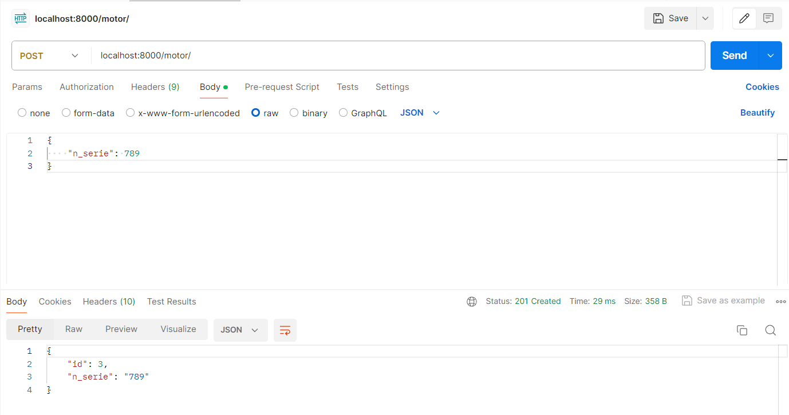

# INF236-2024-1-GRUPO-007
- [Información del grupo](#información-del-grupo)
  - [Wiki](#wiki)
  - [Video Prototipo](#video-prototipo)
- [Proyecto Base](#proyecto-base)
  - [Instalación](#instalación)
    - [Creación del proyecto:](#creación-del-proyecto)
    - [Parte con Django:](#parte-con-django)
  - [Endpoints](#endpoints)


# Información del grupo

Este es el repositorio del Grupo 7, cuyos integrantes son:

* Blas Olivares  - 202104033-1
* Nayely Perez   - 202173124-5
* Octavia Jara   - 202273018-8
* Eduardo Lillo  - 202173094-k
* **Tutor**: Antonia Valenzuela

## Wiki

Puede acceder a la Wiki mediante el siguiente [enlace](https://gitlab.com/antonia.v/inf2024-1-grupo-007/-/wikis/home)

## Video Prototipo
Puede acceder al video explicativo del prototipo desarrollado [aquí.](https://www.youtube.com/watch?v=9xmHi_kpDZE)

# Proyecto Base
* Clonar este repositorio e ingresar el siguiente código:
```
docker-compose build
docker-compose up
```
Una ves iniciado el docker se deve crear un nuevo usuario para esto se realiza una peticion POST a la API en el endpoint http://localhost:8000/register pasandole un json con el siguiente formato
```
{
  "rut": "12.345.678-9",
  "nombre": "nombre empleado",
  "password": "constraseña",
  "is_jefe_motor": false
}
```
<!-- ## Instalación

* Instalar [Docker](https://docs.docker.com/engine/install/).
* Instalar [Docker Compose](https://docs.docker.com/compose/install/)
* Clonar este repositorio e ingresar el siguiente código:
```
docker-compose build
docker-compose up
```

¡Listo!

Este proyecto contiene los docker de la Base de Datos y la API. Deben añadir un tercer contenedor al archivo `docker-compose-yaml` con las configuraciones de la Vista que deseen utilizar.

A continuación se presenta una breve explicación de los pasos hechos para crearlo.

### Creación del proyecto:
* Crear el entorno virtual `python3 -m venv venv`.

Se utiliza el modulo `venv` (penúltimo argumento), que se instala en la carpeta creada `venv` (último argumento). 

* Setear entorno virtual `source venv/bin/activate`

Se activará el entorno virtual y para poder correr el codigo se debe `pip install -r requirements.txt` donde estan las librerias que hay que descargar en nuestro entorno.

### Parte con Django:
Creación del modelo, en este caso se crea la entidad **Motor** con su atributo **n_serie**, el cual hace referencia a _Número de serie_. 

Luego se hace migración a la Base de Datos con los siguientes comandos:
```
python manage.py makemigrations
python manage.py migrate
```

A continuación se crea el _serializer_, esto es un componente de Django que permite transformar y manejar diferentes modelos de datos (para que Django entienda el modelo).

Luego se creó la lógica del negocio. Se utiliza la clase padre `ModelViewSet`, la cual permite heredar las acciones CRUD necesarias para el proyecto.


PD: El código está comentado en inglés, para que practiquen ;D

## Endpoints

Una vez hayan levantado los contenedores pueden utilizar [Postman](https://www.postman.com) u otra herramienta similar para probar los endpoints.
En el proyecto base se han implementado los siguientes:
```
GET: localhost:8000/motor/
POST: localhost:8000/motor/
PUT: localhost:8000/motor/{id_motor}/
DELETE: localhost:8000/motor/{id_motor}/
```
Ejemplo:
 -->

## Notas del grupo

Una vez el contenedor está levantado, se puede escribir "localhost:8000/incidencia" para acceder a la interfaz de usuario del registro de incidencias del mecánico.
Además, ahora las tablas del backend funcionan, no obstante no se están utilizando en nada de momento.
